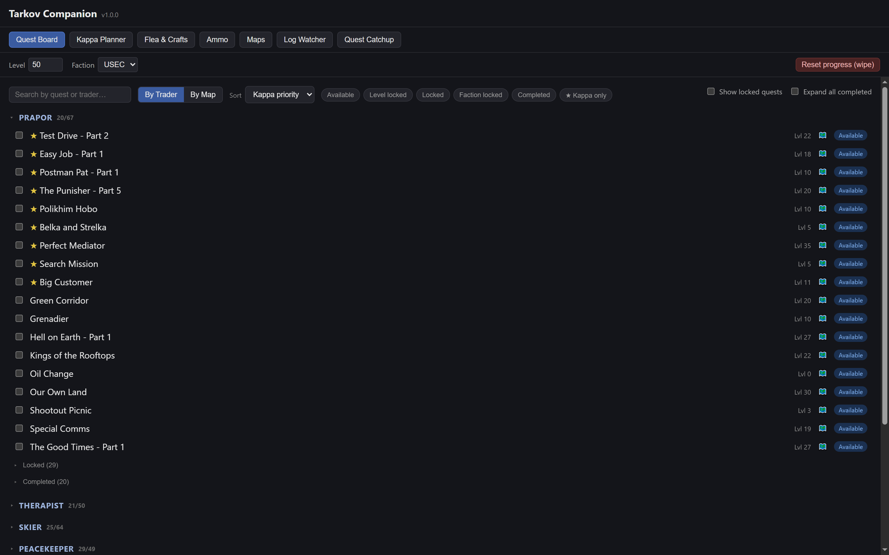
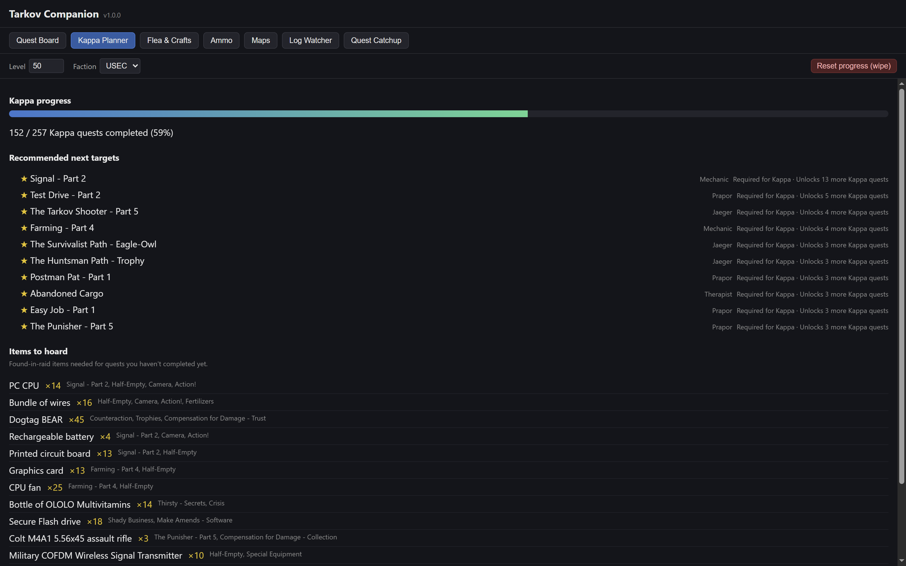
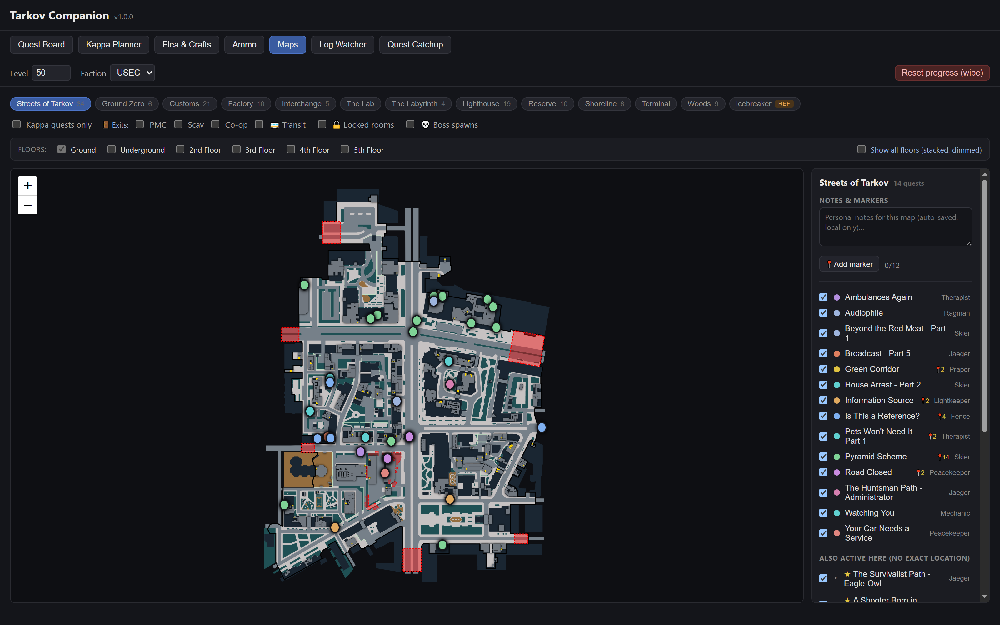
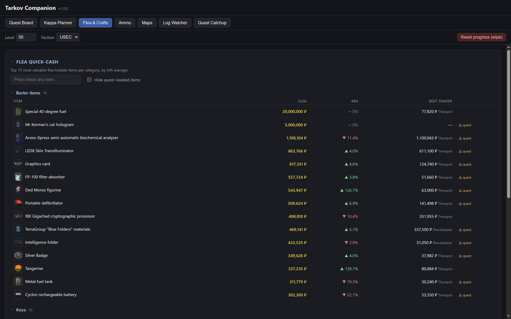
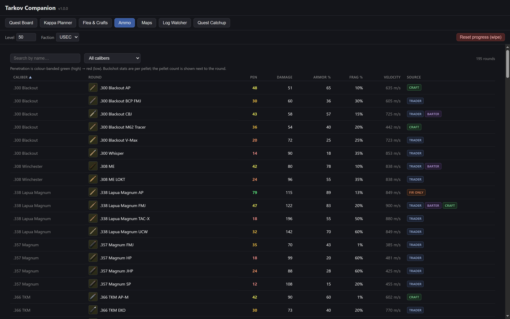

# Tarkov Companion

A Windows desktop companion for **Escape From Tarkov**. It watches the game's log files
to track your quest progress automatically, tells you what to do next for Kappa, shows a
quick-cash flea panel, and renders interactive maps with your active quest objectives
marked on them.

It reads log files only. It never touches the game process or memory. See
[Privacy & safety](#privacy--safety).



## Features

**Automatic quest tracking.** A log watcher tails Tarkov's `notifications.log` and picks
up quest started / failed / completed events as they happen — no manual check-off needed.
It finds your game install from the registry (BSG launcher or Steam), and can replay your
historical logs to reconstruct progress from before you installed the app. Manual
check-off is always available as a fallback.

**Kappa planner.** Tracks your progress toward the Kappa container and recommends what to
do next, scored by how many downstream Kappa quests each one unblocks — so long chains
like Punisher surface early rather than blocking you at the end. Includes an "items to
hoard" list of found-in-raid items future quests will need, so you don't sell something
you'll have to re-farm.



**Interactive maps.** Every map, with your active quest objectives pinned at their real
in-game coordinates, plus extracts (PMC / Scav / co-op / transit), locked rooms, and boss
spawns as toggleable layers. Multi-floor maps switch floors properly. You can drop your
own markers and keep per-map notes, stored locally.



**Flea quick-cash & hideout crafts.** The most valuable flea-listable items by category
with 48h price trends and best-trader comparison, so you know what's worth hauling out.
Items a future quest needs are flagged, and craft profitability is calculated from live
prices.



**Ammo chart.** All 195 rounds with penetration, damage, armor damage, fragmentation and
velocity, colour-banded by penetration and filterable by caliber, with each round's source
(trader / barter / craft / found-in-raid only).



**Quest Catchup.** Screen-capture + OCR of your in-game quest list to bulk-infer progress
in one pass, for when you're setting the app up mid-wipe.

Plus: PvE and PvP profile support (defaults to PvE), wipe reset, launch-at-startup,
minimize-to-tray, and a global capture hotkey.

## Install

Grab the latest build from the [Releases](../../releases) page. Two options:

| Download | Use when |
| --- | --- |
| `Tarkov Companion Setup <version>.exe` | **Recommended.** Normal installer — Start Menu and desktop shortcuts, and it can update itself in-app. |
| `Tarkov Companion-<version>-portable.exe` | You want a single file with no install. Cannot self-update — you'll be pointed at the download instead. |

### "Windows protected your PC"

Expected. The app isn't code-signed (a certificate costs a few hundred dollars a year,
which is hard to justify for a tool shared with friends), so SmartScreen warns that the
publisher is unrecognized. Click **More info** → **Run anyway**. If you'd rather not take
that on faith, build it from source — the instructions are below and the source is all here.

## Privacy & safety

- **Log files only.** The app reads Tarkov's log files from disk. It does not read or
  write game memory, inject into the game process, or automate any input to the game.
  This is the same passive approach [TarkovMonitor](https://github.com/the-hideout/TarkovMonitor)
  uses.
- **Your data stays on your machine.** Progress, settings and notes are plain JSON in
  `%APPDATA%/tarkov-companion/`. There is no account, no telemetry, and nothing is
  uploaded anywhere.
- **Network access** is limited to fetching public game data and prices from
  [tarkov.dev](https://tarkov.dev)'s API (no key, no identifying information), map art,
  and wiki images — enforced by an HTTPS host allowlist in the main process.
- **No competitive advantage.** Everything shown is public data plus your own quest
  history. Nothing here reads the raid you're in.

## Build from source

Requires Node.js 20+ and Windows.

```
npm install
npm run dev        # run in development
npm test           # unit tests
npm run typecheck  # type checking
npm run package:win   # build the installer + portable exe into dist/
```

## Tech

Electron + Vite + React + TypeScript, with Leaflet for the maps and tesseract.js for OCR.
Game data comes from the [tarkov.dev](https://tarkov.dev) GraphQL API; map art and the
coordinate transforms come from [tarkov-dev](https://github.com/the-hideout/tarkov-dev).
The quest engine (prerequisite graph, Kappa scoring) is pure TypeScript and unit-tested.

## Credits

Built on the shoulders of the community's open tooling:

- [tarkov.dev](https://tarkov.dev) — the free, keyless API this app is built on, and the
  map art and transforms.
- [TarkovMonitor](https://github.com/the-hideout/TarkovMonitor) — proof that quest events
  are readable from the logs, and the reference for which log entries matter.
- [TarkovTracker](https://github.com/tarkovtracker-org/TarkovTracker) — quest tracking
  prior art.
- [RatScanner](https://github.com/RatScanner/RatScanner) — item value prior art.

The bundled OCR model (`resources/eng.traineddata`) is the English traineddata from
[tesseract-ocr/tessdata](https://github.com/tesseract-ocr/tessdata), © Google Inc.,
licensed under the [Apache License 2.0](https://www.apache.org/licenses/LICENSE-2.0).
It is redistributed here unmodified so the packaged app never downloads a model at
runtime.

Not affiliated with Battlestate Games. Escape From Tarkov is a trademark of Battlestate
Games.

## License

MIT — see [LICENSE](LICENSE).
